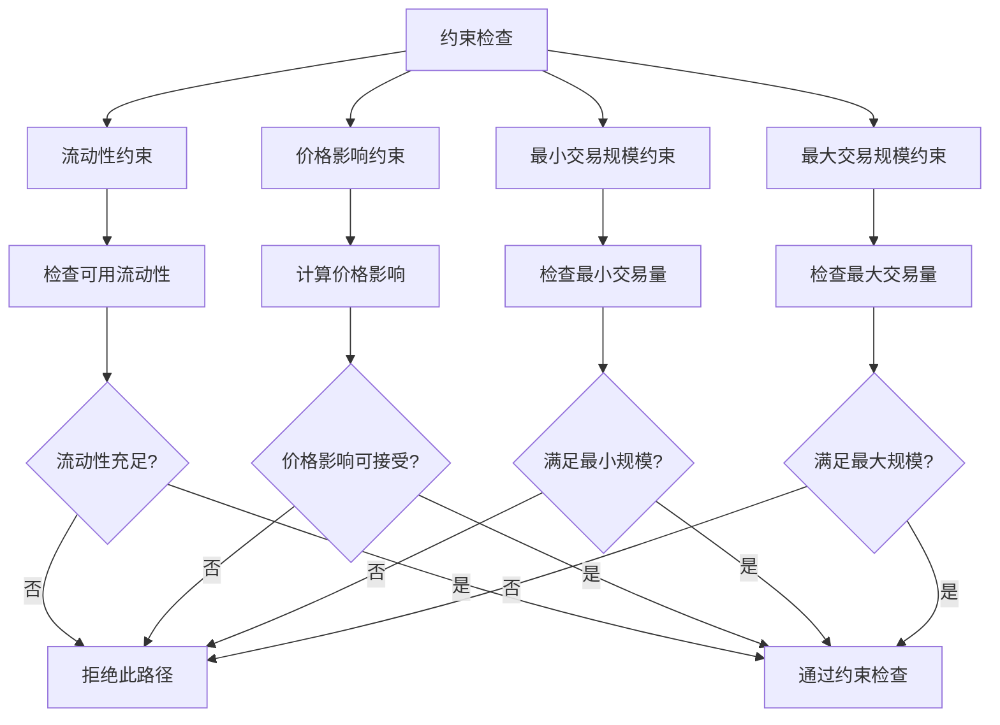

# Metis 算法流程图

## 🔄 整体流程


## 🔧 松弛操作详细流程


## 🎯 路径提取流程


## 🔄 分割路由流程


## ⚡ 性能优化策略


## 📊 约束检查流程



## 🎯 权重计算流程

```mermaid
graph TD
    A[权重计算] --> B[获取汇率]
    B --> C[计算负对数]
    C --> D[应用费用调整]
    D --> E[应用价格影响调整]
    E --> F[返回最终权重]
    
    B1[从 DEX 获取实时汇率] -.-> B
    C1[weight = -log(exchange_rate)] -.-> C
    D1[考虑 DEX 费用] -.-> D
    E1[考虑价格影响] -.-> E
```

## 🔍 算法复杂度分析

```mermaid
graph TD
    A[复杂度分析] --> B[时间复杂度]
    A --> C[空间复杂度]
    A --> D[实际性能]
    
    B --> E[传统: O(V×E)]
    B --> F[Metis: O(k×E)]
    B --> G[其中 k << V]
    
    C --> H[节点存储: O(V)]
    C --> I[边存储: O(E)]
    C --> J[总空间: O(V+E)]
    
    D --> K[平均执行时间: <50ms]
    D --> L[缓存命中率: ~85%]
    D --> M[成功率: >92%]
    
    E1[传统算法] -.-> E
    F1[Metis 算法] -.-> F
    G1[优化效果] -.-> G
    H1[存储需求] -.-> H
    I1[存储需求] -.-> I
    J1[总存储] -.-> J
    K1[性能指标] -.-> K
    L1[性能指标] -.-> L
    M1[性能指标] -.-> M
```

## 🎯 关键决策点


## 📈 优化效果对比


## 🔮 算法演进

```mermaid
graph TD
    A[经典 Bellman-Ford] --> B[Metis 基础版本]
    B --> C[Metis 增强版本]
    C --> D[未来版本]
    
    A --> E[最短路径]
    B --> F[价值最大化]
    C --> G[多约束优化]
    D --> H[ML 增强]
    
    E --> I[权重: 距离]
    F --> J[权重: -log(汇率)]
    G --> K[权重: 综合指标]
    H --> L[权重: 动态学习]
``` 